# `koyeb-github-runner-scheduler`

> [!CAUTION]
> This is a work in progress! Do not run it alongside production workloads.
> Use a dedicated koyeb organization.

**koyeb-github-runner-scheduler** is a golang HTTP server accepting requests from GitHub webhooks to dynamically start GitHub runners on Koyeb.

## Overview

By default, GitHub actions are run by shared runners hosted on GitHub. These runners are free, but due do to their shared nature, they can be slow and have limited resources. To overcome these limitations, we've created a GitHub runner that can be deployed on Koyeb. To deploy this runner manually, check out [github.com/koyeb/koyeb-github-runner](https://github.com/koyeb/koyeb-github-runner).

`koyeb-github-runner-scheduler` is a companion to the GitHub runner.  It takes over the responsibility for receiving repository update messages and acts as a job dispatcher. When a job is received from GitHub, the scheduler starts a new GitHub runner on Koyeb, and registers it to the repository or organization that sent the job. The runner will then execute the job. After a configured amount of time, if no new jobs are received, the scheduler will delete the runner. This way, you only pay for the time your runner is actually running and you don't have to keep a runner ready 24/7.

To fully understand how this scheduler works, there are some key concepts you should be aware of. If you are already familiar with GitHub runners, you can skip this section and go directly to the [Usage](#usage) section below.

### Webhooks

GitHub has a mechanism called [webhooks](https://docs.github.com/en/developers/webhooks-and-events/about-webhooks) that allows you to receive notifications from GitHub whenever certain events related to your repository occur. For example, when a new commit is pushed to a repository, a pull request is created, or a new issue is opened.

This scheduler expect to receive notifications related to the `workflow_job` event, which is triggered when a job is started and needs to be executed by a runner.

### Repository or Organization Runner?

GitHub offers two options to register a runner: for a specific repository or for an entire organization. Runners configured for a specific repository will only run jobs for that repository. Runners configured for an entire organization will run the jobs for all the repositories of that organization.

In either case, you need to register a webhook for the desired scope (a repository or an organization), and configure the scheduler with a token with the appropriate permissions.

### Requirements

To use this scheduler, you need:

- A Koyeb account.
- (Optional) the [Koyeb CLI](https://www.koyeb.com/docs/build-and-deploy/cli/installation) installed and configured. Make sure you have the latest version installed. 

## Usage

To start the scheduler on Koyeb, follow these steps:

1. [Create a GitHub token](#1-create-a-github-token)
2. [Create the Koyeb Application and Service](#2-create-the-koyeb-application-and-service)
3. [Configure the webhook on GitHub](#3-configure-the-webhook-on-github)
4. [Create a workflow job](#4-create-a-workflow-job)

### 1. Create a GitHub token

#### For a repository

If you want to register the scheduler for a specific repository, visit the [Developer settings](https://github.com/settings/tokens?type=beta) of your account settings:

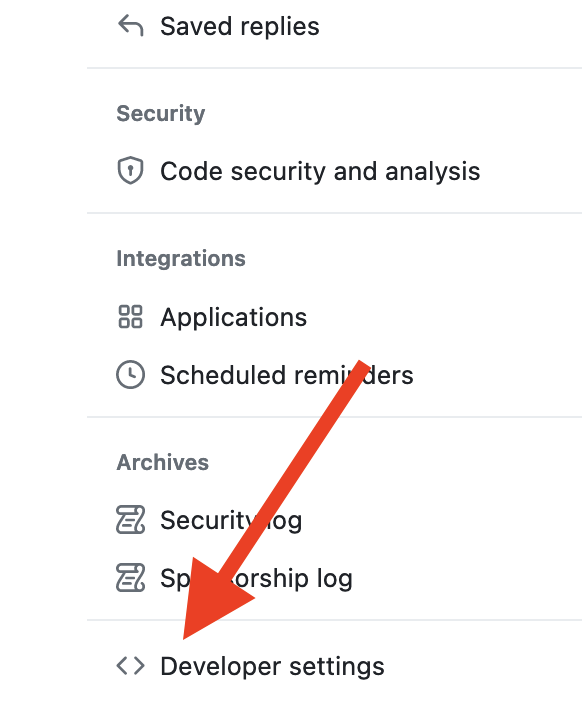

Under the "Fine-grained tokens" section, click [Generate new token](https://github.com/settings/personal-access-tokens/new):

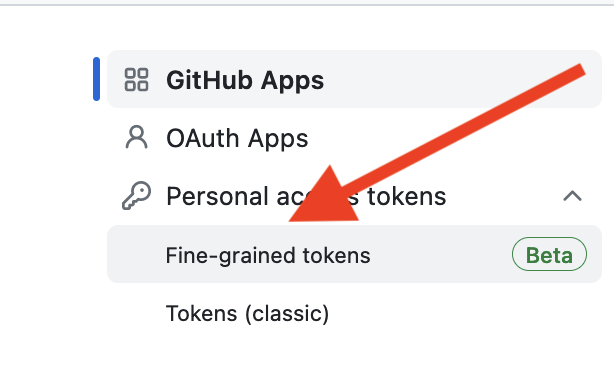
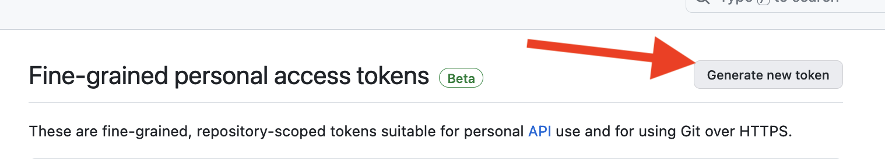

Set the token name and expiration, choose "Only select repositories", and select the repository you wish to configure:

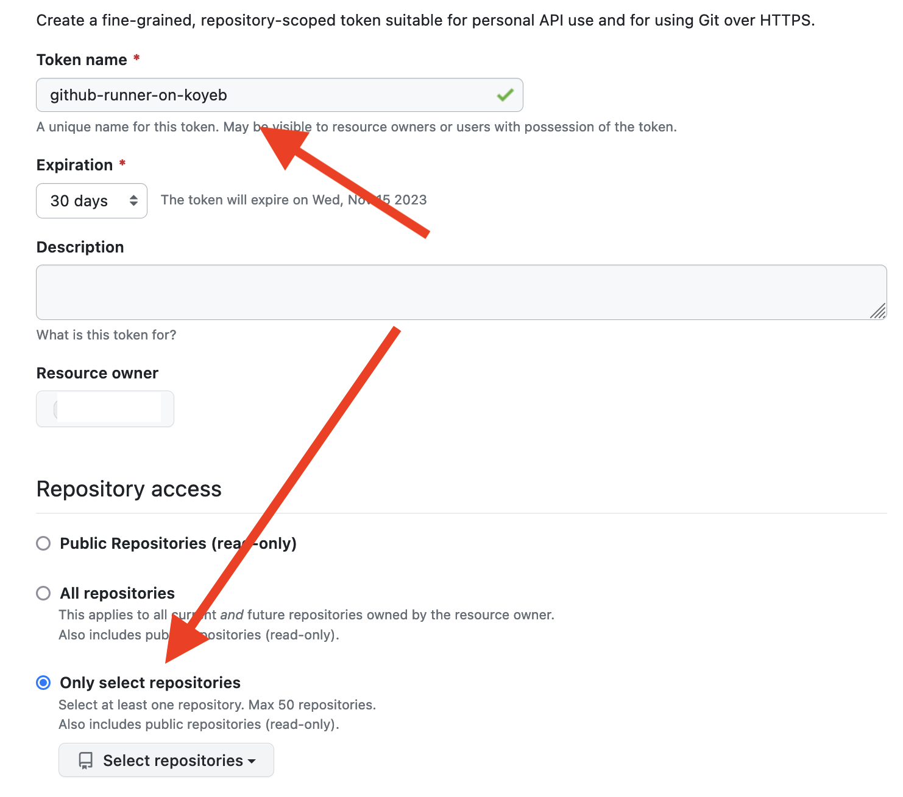

In the "Permissions" section, select "Read & Write" access for the "Administration" item:

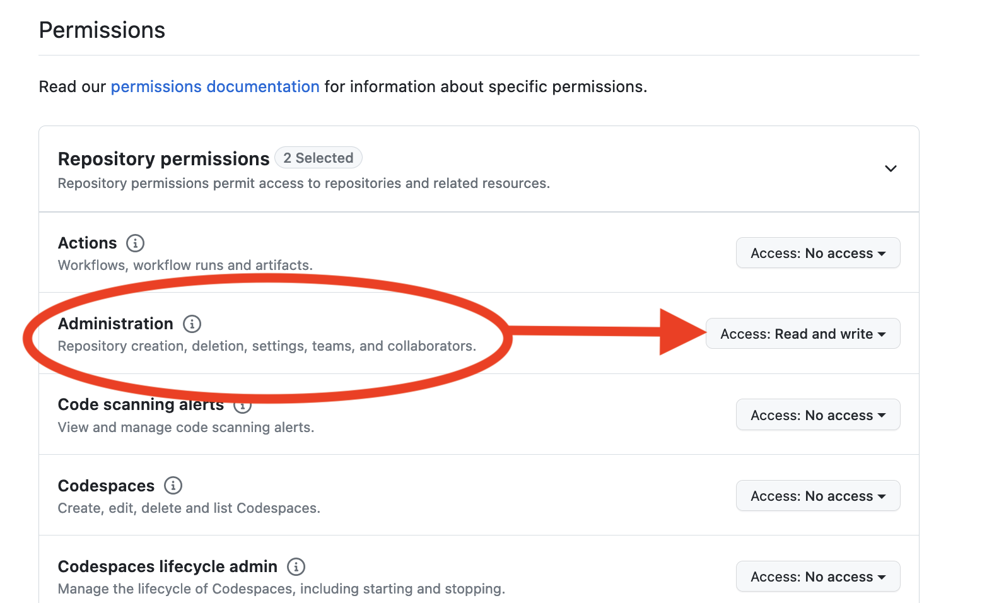

#### For an organization

If you want to register the scheduler for your organization, visit the [Developer settings](https://github.com/settings/tokens?type=beta) of your account settings:


Under the "Fine-grained tokens" section, click [Generate new token](https://github.com/settings/personal-access-tokens/new):


Set the token name and expiration, select your organization under "Resource owner", and choose "All repositories" under the access settings:

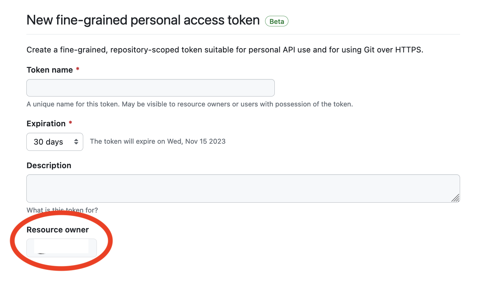

Select your organization and in the "Organization Permissions" section, select "Read & Write" access for "Self-hosted runners":


### 2. Create the Koyeb Application and Service

#### With the `koyeb` CLI

First, create a new application:

```sh
koyeb app create github-runner-scheduler
```

Then, create a new service:

```sh
koyeb service create \
    --docker koyeb/github-runner-scheduler \
    --routes /:8000 \
    --ports 8000:http \
    --env KOYEB_TOKEN=xxx \
    --env GITHUB_TOKEN=xxx \
    --env API_SECRET=xxx \
    --env MODE=<"repository" or "organization"> \
    --app github-runner-scheduler \
    scheduler
```

Make sure to replace the following values:

| Variable name    | Value                                                                                                                                                                                                                                             |
|------------------|---------------------------------------------------------------------------------------------------------------------------------------------------------------------------------------------------------------------------------------------------|
| **GITHUB_TOKEN** | The token you created in the previous step.
| **KOYEB_TOKEN**  | A token created on the [Koyeb control panel](https://app.koyeb.com/user/settings/api), which will be used to create Koyeb instances dynamically.
| **API_SECRET**   | A random secret used to authenticate requests from GitHub webhooks. You will need to enter the same value when configuring the webhook on GitHub afterwards.
| **MODE**         | Either `repository` or `organization`, depending on the type of runner you want to configure. The default value is `repository`. To set up a runner for an organization, set this value to `organization` or the runners will fail to start.

If you don't need your runners to start a Docker daemon to run your jobs, you can disable it by including `--env DISABLE_DOCKER_DAEMON=true` in your command. This will reduce the startup time of your runners and reduce memory usage.

By default, the scheduler will delete runners 120 minutes (2 hours) after the last job is received. You can change this value by including `--env RUNNERS_TTL=xxx`, where `xxx` is the number of minutes after which the runners will be deleted.

#### With the control panel

If you prefer using the control panel, follow these steps:

1. Create a new Docker project
2. Use the `koyeb/github-runner-scheduler` image
3. Select the "Web Service" service type
4. Set the following environment variables:

| Variable name | Value |
|---------------|-------|
| **GITHUB_TOKEN** | The token you created in the previous step.
| **KOYEB_TOKEN** | A token created on the [Koyeb control panel](https://app.koyeb.com/user/settings/api), which will be used to create Koyeb instances dynamically.
| **API_SECRET** | A random secret used to authenticate requests from GitHub webhooks. You will need to enter the same value when configuring the webhook on GitHub afterwards.
| **MODE** | Either `repository` or `organization`, depending on the type of runner you want to configure. The default value is `repository`. To set up a runner for an organization, set this value to `organization` or the runners will fail to start.

If you don't need to start a Docker daemon to run your jobs, you can disable it by including a `DISABLE_DOCKER_DAEMON` environment variable set to `true`.

By default, the scheduler will delete the runner 120 minutes (2 hours) after the last job is received. You can change this value by setting the `RUNNERS_TTL` environment variable to the number of minutes after which the runners will be deleted.

### 3. Configure the webhook on GitHub

#### For a repository

To register the scheduler for a specific repository, go to your repository's settings, select the "Webhooks" page, and click "Add webhook":

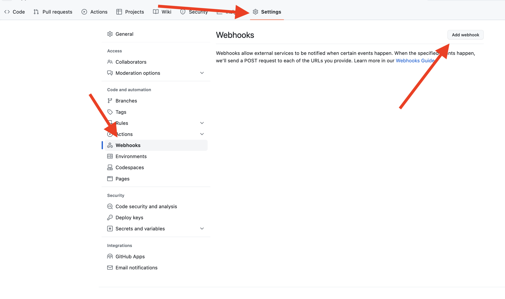

#### For an organization

To register the scheduler for your organization, go to your organization's settings, select the "Webhooks" page, and click "Add webhook":

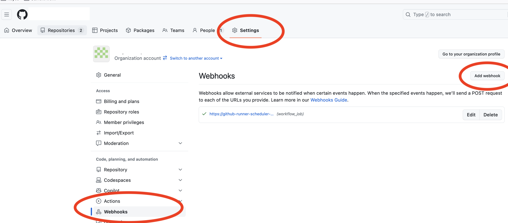

#### Configure the webhook

The process for configuring webhooks is the same for individual repositories and organizations.

On the top of the page, enter the following information:

* **Payload URL**: The public URL of your Koyeb Service, which can be found on the [control panel](https://app.koyeb.com).
* **Content type**: Select `application/json`.
* **Secret**: Enter the same value you used for the `API_SECRET` environment variable in the previous step.

Then, under "Which events would you like to trigger this webhook?", select "Let me select individual events":

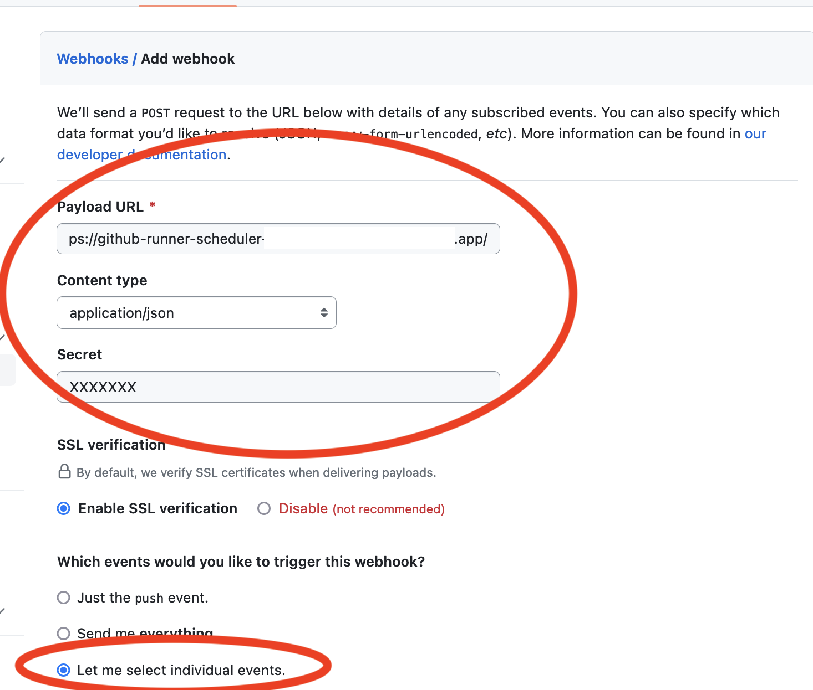

Uncheck all events except for "Workflow jobs":

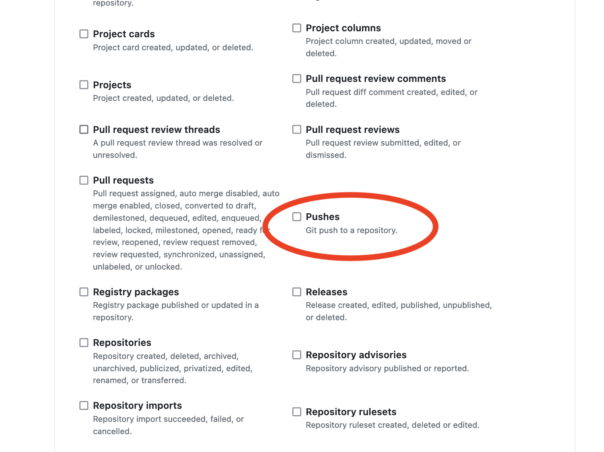
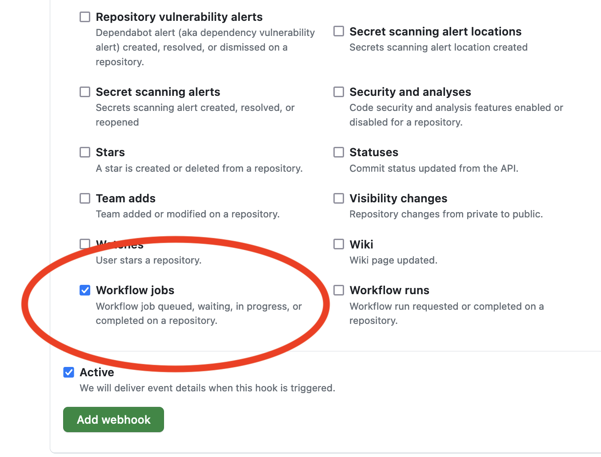

Click "Add webhook" to save the webhook. While the webhook is now configured, your scheduler is not yet ready to receive repository events from GitHub.

### 4. Create a workflow job

In your GitHub repository, create a new workflow file under the `.github/workflows` directory. For example, `.github/workflows/runner.yml`:

```yaml
name: my workflow

on:
  push:
    branches:
      - master

jobs:
  koyeb-paris:
    runs-on: koyeb-par-medium
    steps:
      - name: Test runner
        run: |
          echo Hello from Paris, on a Koyeb nano instance!

  koyeb-frankfurt:
    runs-on: koyeb-fra-small
    steps:
      - name: Test runner
        run: |
          echo Hello from Frankfurt, on a Koyeb nano instance!
```

In this example, we have two jobs.

The first job `runs-on` is set to `koyeb-par-medium`. This means that GitHub will look for a runner with the label `koyeb-par-medium` to execute this job.  If it cannot find a runner with the given label, it will create a new medium runner in Paris with this label and register it to the repository or organization. The runner will then execute the job.

The second job is similar, except that it will run on a small runner in Frankfurt.

The scheduler labels use the following format:

```
koyeb-<REGION>-<INSTANCE_TYPE>
```

You can consult Koyeb's documentation to find the available values for [regions](https://www.koyeb.com/docs/reference/regions#core-regions) and [instance types](https://www.koyeb.com/docs/reference/instances#instance-types).


## 🙋‍♂️ Contributing

We are actively working on this project, so if you have feedback (whether this project is working for you or not), we would **love** to hear from you on our [Slack channel](https://slack.koyeb.com/).
